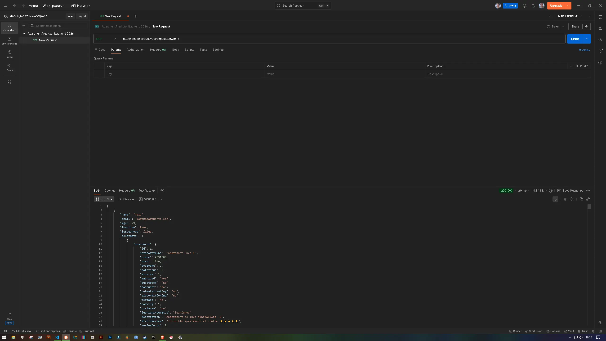
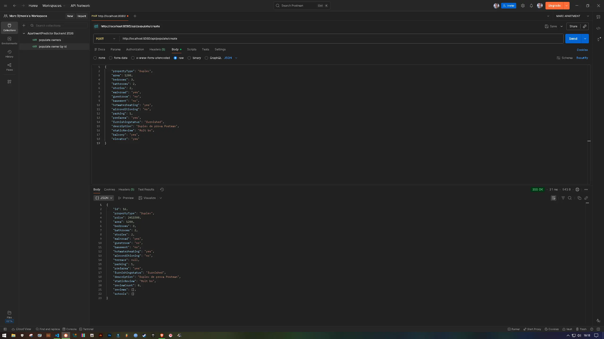
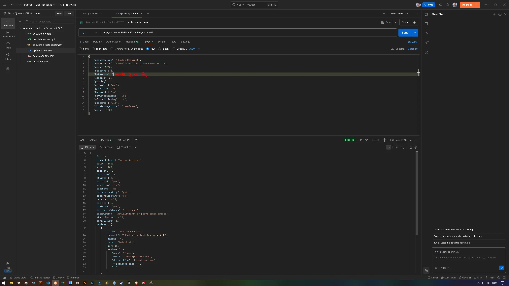
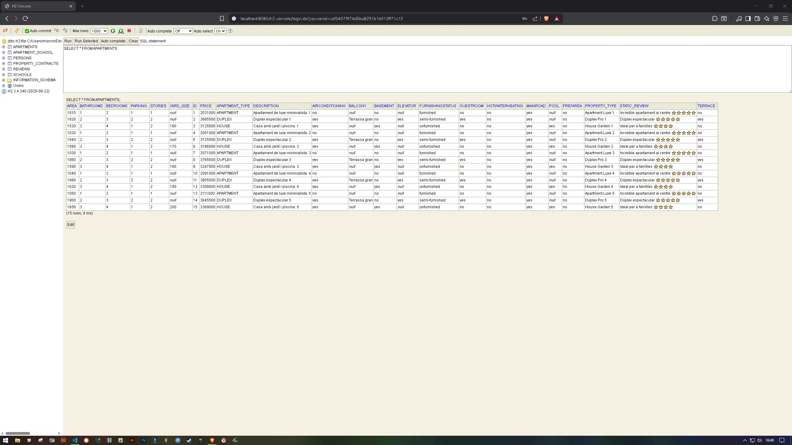
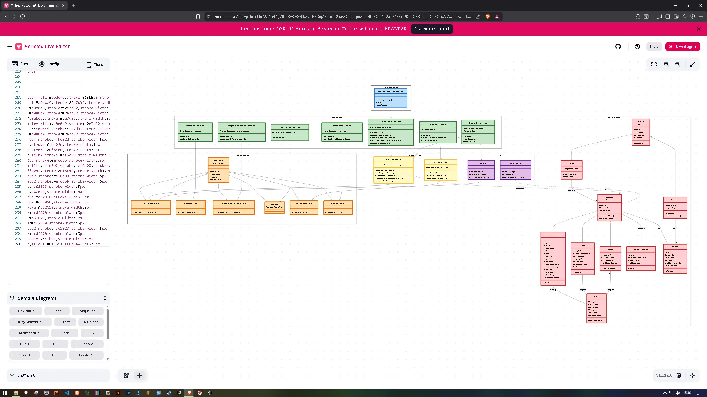

## 1. Modelatge i Herència (✅) 
## 2. Implementació JPA + Repositories (✅)
## 3. Population de Dades (✅) 
## 4. REST Controllers i CRUD (✅)
## 5. UML en Mermaid (✅)  
## 6. Product Goal (✅)
## 7. Captures de pantalla (✅)
    - **H2 Console:** Fes una captura on es vegin les taules plenes (`SELECT * FROM PROPERTY`).
    - **Postman:** Captures de 5 crides diferents (GET, POST, etc.) on es vegi que funciona.
        
# 8. Export de Postman: (✅)

---

# 🎯 1. Product Goal: PINT APART Backend

### **Business Purpose**
La idea de **PINT APART** neix de la necessitat de professionalitzar la gestió d'immobles. En lloc de dependre de llistes desactualitzades o Excels on és fàcil perdre el fil, aquest backend centralitza tot el que importa: des de la meva pròpia casa o dúplex fins a les ressenyes dels experts. El valor real és que permet a qualsevol gestor tenir una "foto" real de la seva cartera, sabent quins serveis hi ha al voltant (com escoles) i automatitzant el càlcul de preus per tancar operacions més ràpidament i sense perdre temps en tràmits manuals.

### **Technical Purpose**
A nivell tècnic, l'objectiu era construir un motor capaç de gestionar relacions complexes sense que el codi es torni un caos. He aprofitat el potencial de **Spring Boot** i **JPA** per crear una estructura on les dades estan connectades: si mirem una propietat, sabem qui és l'amo i què en diuen els *reviewers*. A més, m'he assegurat que el sistema sigui "fresc": he implementat un sistema de "reset" total que neteja la base de dades H2 i carrega dades realistes en un sol clic, facilitant les proves i assegurant que els endpoints REST retornen sempre la informació que el frontend necessita.

---

# 📄 Justificació de l'Estratègia d'Herència JPA

He decidit separar la manera com gestionem les persones de com gestionem les propietats perquè tenen necessitats diferents:

### **Jerarquia de Persones (Person → Owner, Reviewer)**
He optat per l'estratègia de **Single Table** (`@Inheritance(strategy = InheritanceType.SINGLE_TABLE)`).

* **Raonament:** He triat aquesta opció perquè un propietari i un revisor són, en essència, gairebé el mateix a nivell de dades (nom, email, telèfon). Crear taules separades obligaria a fer `JOINs` constants per a operacions senzilles.
* **Avantatges:** La velocitat de consulta és màxima, ja que tota la informació resideix en una sola taula (`persons`). El camp `discriminator` ens permet diferenciar fàcilment el rol de cada usuari sense penalitzar el rendiment de la base de dades H2.

### **Jerarquia de Propietats (Apartment → House, Duplex)**
Per a la gestió d'immobles, hem utilitzat una estructura de taules separades.

* **Raonament:** A diferència de les persones, una casa amb jardí i piscina té atributs molt diferents als d'un dúplex o un apartament en un quart pis amb ascensor.
* **Decisió Tècnica:** He prioritzat la claredat del model de dades per evitar tenir una taula plena de buits (`nulls`). He triat una estratègia que permeti mantenir la integritat de cada tipus de propietat (com `@MappedSuperclass` o `TABLE_PER_CLASS`), fent que el sistema sigui fàcilment escalable si demà vull afegir naus industrials o trasters.

---

# 🛠️ Conclusió i Desafiaments

Durant el desenvolupament de la PRA#02 m'he trobat amb diversos problemes tècnics que he hagut d'anar polint:

* **El trencaclosques de l'esborrat (Cascading):** Al principi, no podia esborrar res perquè les claus foranes em bloquejaven (no pots treure un pis si encara té contractes o reviews penjant). 
    * **Solució:** He ajustat el mètode `deleteById` i el `executeFullReset` al Service per assegurar-me que primer s'esborren les dades dependents (els "fills") abans d'eliminar l'apartament o l'amo.

* **La batalla contra els IDs infinits (Data Population):** Aquest ha estat el repte més pesat. Cada vegada que feia un "Reset", els IDs seguien pujant (4, 5, 6...) en lloc de tornar a l'1, trencant la lògica del meu frontend.
    * **Solució:** He implementat consultes natives de SQL (`ALTER TABLE ... RESTART WITH 1`) dins del Service. Amb això, forço a la base de dades H2 a posar el comptador a zero cada vegada que netegem les taules.

* **Fent que el codi entengui qui és qui (Discriminator):** En fer servir una sola taula per a Owners i Reviewers, calia que Spring sabés diferenciar-los sense errors de càsting.
    * **Solució:** He configurat les anotacions `@DiscriminatorColumn` i `@DiscriminatorValue`. Ara la base de dades etiqueta clarament cada fila i el codi sap quina classe ha d'instanciar en cada moment.

> **Nota sobre les dades:** Per a la població inicial, he utilitzat exemples realistes basats en la meva pròpia experiència amb un duplex i una casa, assegurant que els preus i superfícies tinguin sentit en un entorn real.

## Screenshots de Postman (link: https://marcmonfort120-9324369.postman.co/workspace/Marc-Djmon's's-Workspace~bb6c36ef-565c-4a1b-8f1d-805f61527660/collection/51389689-2d43337c-1e15-4bbf-83cd-39849afc298d?action=share&creator=51389689&active-environment=51389689-db37398e-5da7-4a7b-a25f-ffa5b2e1876a)
**GET all owners**

**POST NEW DUPLEX**

**POST UPDATE DUPLEX**

**H2**

**UML**

---
**PRA02: Desenvolupat per 👤 Marc® PINT APART - 2026®**
